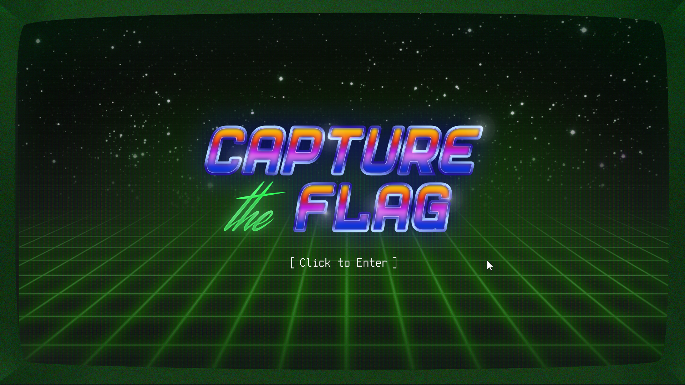

# Synthwave CTF



This is a working rebuild of the Synthwave stylized [2018 Google CTF scoreboard](https://github.com/google/google-ctf/tree/master/infrastructure/scoreboard) that was created using Firebase. The server-side code is `rules.json`, and the client side code is in the `public` directory.

Note that you do not need to use [KCTF](https://google.github.io/kctf/) unless you really want to scale and pay for that Kubernetes cluster.  [Cloud Run](https://cloud.google.com/run/) works just fine to host the CTF for less than a dollar a month.

To run this, you need to make the following changes:
 1. Create a Firebase project, see https://firebase.google.com/docs/web/setup for details.
 1. Import the `example.json` into your Firebase Realtime Database.
 1. Set `rules.json` as the Firebase rules (that's the equivalent of the server-side code).
 1. Modify the following `public/js/bootstrap.js` data attributes:
 ```js
        /** @define {string} API Key for CTF scoreboard */
        const API_KEY = 'INSERT_YOUR_FIREBASE_API_KEY'
        /** @define {string} Auth Domain for CTF scoreboard */
        const AUTH_DOMAIN = 'INSERT_YOUR_FIREBASE_AUTH_DOMAIN'
        /** @define {string} Database URL for CTF scoreboard */
        const DATABASE_URL = 'INSERT_YOUR_DATABASE_URL'
        /** @define {string} Project ID for CTF scoreboard */
        const PROJECT_ID = 'INSERT_YOUR_PROJECT_ID'
        /** @define {string} Storage Bucket for CTF scoreboard */
        const STORAGE_BUCKET = 'INSERT_YOUR_BUCKET'
        const MESSAGE_SENDER_ID = 'INSERT_YOUR_MESSAGE_ID'
        const APP_ID = 'INSERT_YOUR_APP_ID'
```

Yarn is use to run locally (`yarn dev`), build (`yarn build`), and deploy (`yarn deploy`).  Note the `deploy`will build prior to the firebase deploy.

# Notes
The scoreboard uses a third-party font called [VP Pixel Simplified](https://www.fonts.com/font/vp-type/vp-pixel/simplified), you can use instead [Free Pixel](https://www.dafont.com/free-pixel.font). This might require some changes to the CSS.

If you want to build upon this theme, feel free to, if you want to make changes to the graphics, the PSD files are available in the `psd` directory. Props to the original author of the design [Nicolas de Sola](https://www.behance.net/NicodeSola).